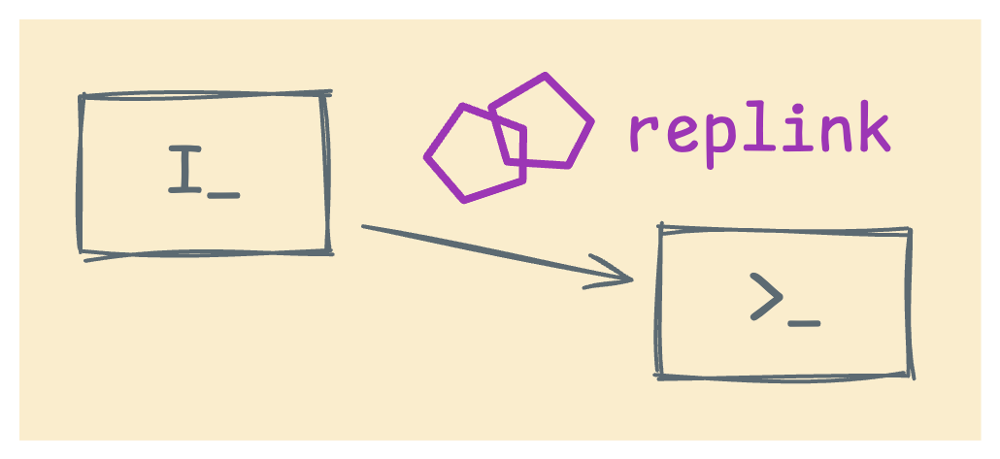

<p align="center">
  
</p>

# replink

`replink` es una herramienta de CLI para enviar código mediante tuberías (piping) a un REPL que se ejecuta en un panel diferente y ejecutarlo allí.

¡Es muy útil cuando quieres evaluar código de forma interactiva, pero tu [editor de código favorito](https://docs.helix-editor.com/master/) no tiene un sistema de plugins [(todavía)](https://github.com/helix-editor/helix/pull/8675), pero puede [enviar el texto seleccionado a un comando de shell](https://docs.helix-editor.com/commands.html#:~:text=the%20shell%20command.-,%3Apipe-to,-Pipe%20each%20selection)!

## Demo


## ¿Por qué?

`replink` envía código desde tu editor a un REPL que se ejecuta en otro lugar.

**Ejemplo**: Código de Python a una consola de IPython dentro de un panel de TMUX.

¿Parece lo suficientemente fácil? La parte del "envío" puede serlo, pero lograr que el código aparezca con el formato correcto al llegar es complicado.

Como descubrieron hace tiempo proyectos anteriores como [vim-slime](https://github.com/jpalardy/vim-slime), la solución reside en el preprocesamiento del código antes de enviarlo y en tener en cuenta si el destino espera [bracketed paste](https://cirw.in/blog/bracketed-paste) o no. Para añadir más diversión, cada lenguaje y cada REPL presentan casos borde sutiles.

Construí `replink` porque me acostumbré a enviar código de Python a un REPL al principio de mi carrera, y Pycharm, VS Code y Vim han servido para reforzar ese hábito. Si disfrutara más manteniendo una configuración de (Neo)vim, simplemente usaría vim-slime o iron.nvim. Pero me gusta [**Helix**](https://docs.helix-editor.com/master/), aunque no tenga un sistema de plugins. Sin embargo, lo compensa con su comando `:pipe-to`, que te permite enviar y olvidar el texto seleccionado como stdin a cualquier comando de shell; en este caso, `replink`. Dile a `replink` qué estás enviando ('language') y a dónde debe ir ('target'); vincula el comando completo a un atajo de teclado de Helix, y ya tienes casi algo que se siente como un plugin.

## Lenguajes y Destinos (Targets)

`replink` soporta estos lenguajes y destinos:

**Lenguajes y REPLs**:

- Python
    + consola estándar (stock)
        - Probado con varios REPLs de python3.
        - Para python <= 3.12, usa `--no-bpaste/-N`. Python >= 3.13 usa bracketed paste.
    + ipython
        - Comando especial `--ipy-cpaste` para pegado `%cpaste` (raramente lo necesito).
    + ptpython
        - Se comporta de manera similar a python 3.13 y superiores.

**Destinos**:

- TMUX
- Zellij

Agregar nuevos lenguajes y destinos es sencillo. Cualquier lenguaje o destino disponible en [vim-slime](https://github.com/jpalardy/vim-slime) puede ser portado. Esto se debe a que la arquitectura de `replink` toma muchas ideas de vim-slime.

¡Se agradecen FRs y PRs!

## Instalación

### Con uv (recomendado)

Usa python >= 3.12.

```bash
uv tool install --python 3.12 replink
```

## Uso

```bash
replink send -l LANGUAGE -t TARGET [OPTIONS] [TEXT/-]
```

### Opciones

- `-l, --lang`: Lenguaje (actualmente solo `python`)
- `-t, --target`: Configuración del destino
  - TMUX: `tmux:p=<pane>` (ej. `tmux:p=right`, `tmux:p=1`)
  - Zellij: `zellij:p=<direction>` o `zellij:s=<session>:p=<direction>`
- `-N, --no-bpaste`: Desactivar bracketed paste (para Python < 3.13)
- `--ipy-cpaste`: Usar el comando %cpaste de IPython
- `--debug`: Activar el registro de depuración (debug logging)

### Ejemplos

#### Enviar código mediante pipe

Así es como suelo usar replink, excepto que envío mediante pipe lo que esté seleccionado en mi editor.

##### TMUX

```bash
cat script.py | replink send -l python -t tmux:p=right
```

`tmux:p=right` significa 'usar TMUX y enviar al panel a la derecha del panel actual'. (El valor de `p` puede ser cualquier cosa que pueda ser interpretada por `tmux selectp -t $VALUE`.)

También es válido especificar el destino de TMUX usando el número de panel. (Presionar `<prefix-key> q` muestra los números de panel.)

```bash
echo 'print("well hello there")' | replink send -l python -t tmux:p=4
```

##### Zellij

```bash
cat script.py | replink send -l python -t zellij:p=right
```

`zellij:p=right` significa 'usar Zellij y enviar al panel a la derecha del panel actual'.

Zellij solo soporta posicionamiento direccional: `current`, `right`, `left`, `up`, `down`.

También puedes dirigirte a una sesión específica de Zellij:

```bash
cat script.py | replink send -l python -t zellij:s=dev:p=down
```

#### Código como argumento

El código también puede pasarse a `replink` como un argumento posicional.

```bash
replink send -l python -t tmux:p=right 'print("oh hi!")'
```

Realmente solo uso esto cuando estoy depurando, ya que el depurador integrado de Python no se lleva bien con las tuberías activas.

Sin embargo, hace que lo siguiente sea un poco más fácil de escribir:

```bash
replink send -l python -t tmux:p=right 'exit()'
```

#### Python < 3.13 (sin bracketed paste)

Hasta Python 3.12 inclusive, la consola estándar de Python no soporta bracketed paste, así que asegúrate de desactivarlo con `--no-bpaste` (o `-N`).

```bash
# TMUX
cat script.py | replink send -l python -t tmux:p=right --no-bpaste

# Zellij
cat script.py | replink send -l python -t zellij:p=right --no-bpaste
```

## Integración con Editores

### Helix

Añade a tu `~/.config/helix/config.toml`:

```toml
[keys.normal."minus"]
# Para TMUX
x = ":pipe-to replink send -l python -t tmux:p=right"

# Para Zellij
x = ":pipe-to replink send -l python -t zellij:p=right"
```

Ahora puedes seleccionar código y presionar `<minus>x` para enviarlo a tu REPL de Python. (Uso minus/guion (`-`) como mi leader para atajos personalizados.)

**Pro tip**: Si estás compilando Helix desde master, puedes especificar el lenguaje dinámicamente pasándolo como una [expansión de línea de comandos](https://docs.helix-editor.com/master/command-line.html#expansions). Por ejemplo:

```toml
[keys.normal."minus"]
# TMUX
"x" = ":pipe-to replink send -l %{language} -t tmux:p=right"

# Zellij
"x" = ":pipe-to replink send -l %{language} -t zellij:p=right"
```

### Vim/Neovim

No estoy seguro de por qué usarías `replink` en Vim, donde existen mejores opciones. ¡Pero esto es lo que Claude sugiere!

```vim
" Enviar línea actual
nnoremap <leader>x :.!replink send -l python -t tmux:p=right<CR>
" Enviar selección visual
vnoremap <leader>x :!replink send -l python -t tmux:p=right<CR>
```

### VS Code

Crea una tarea en `.vscode/tasks.json`:

```json
{
    "version": "2.0.0",
    "tasks": [
        {
            "label": "Send to REPL",
            "type": "shell",
            "command": "replink",
            "args": ["send", "-l", "python", "-t", "tmux:p=right", "${selectedText}"]
        }
    ]
}
```

## Extendiendo replink

Añadir lenguajes implica implementar el protocolo `Language_P` en `replink/languages/`. Tú te encargas de las peculiaridades del formato y el comportamiento específico del REPL para tu lenguaje.

Añadir destinos implica implementar el protocolo `Target_P` en `replink/targets/`. Tú te encargas de la mecánica para hacer llegar el texto a donde sea que se esté ejecutando el REPL.

Por ahora solo hay Python y tmux/zellij, pero el diseño debería hacer que sea sencillo añadir JavaScript/Node, Ruby, R o cualquier otro. Lo mismo ocurre con destinos como GNU Screen o emuladores de terminal con sus propias APIs.

## Contribución

Se agradecen los PRs, especialmente para nuevos lenguajes y destinos. La arquitectura debería hacer que esto sea bastante sencillo.

## Agradecimientos

Fuertemente inspirado en [vim-slime](https://github.com/jpalardy/vim-slime), que resolvió todas las partes difíciles hace años. (He copiado liberalmente de este proyecto y he optado por la misma licencia.) También consulté [iron.nvim](https://github.com/Vigemus/iron.nvim) para obtener ideas.


## Licencia

Licenciado bajo la Licencia MIT. Consulta [LICENSE.txt](LICENSE.txt) para más detalles.
